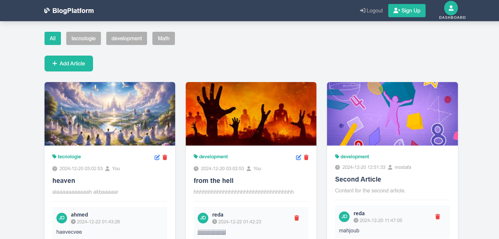
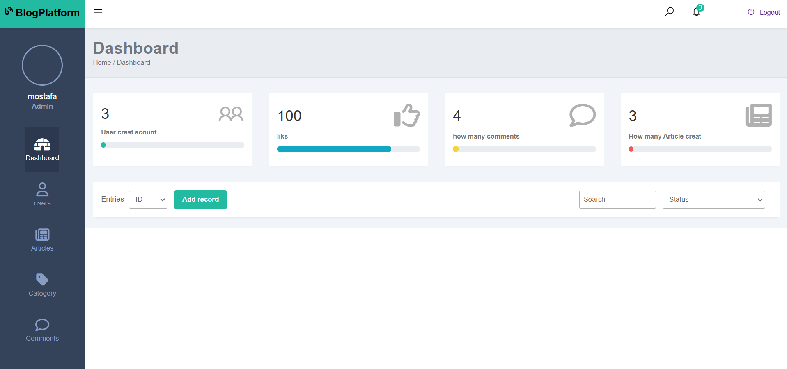

# 🌟 **Plateforme de Blog** 

### 🎯 **Contexte du Projet**
Cette plateforme de blog permet aux utilisateurs de partager leurs idées, commenter des articles et explorer un contenu structuré.

---

## ⚙️ **Fonctionnalités**

### 🔑 **Authentification**
- ✅ S'inscrire avec email, nom d'utilisateur et mot de passe.
- ✅ Se connecter avec email ou nom d'utilisateur et mot de passe.
- ✅ Rester connecté grâce à une session sécurisée ou un cookie \"Se souvenir de moi\".
- ✅ Se déconnecter de manière sécurisée.

### 📝 **Gestion des Articles**
- ✍️ **Utilisateur enregistré** : Créer, modifier ou supprimer des articles avec un titre, contenu et image optionnelle.
- 👀 **Visiteur** : Parcourir et lire les articles publiés.

### 💬 **Système de Commentaires**
- 👤 **Visiteur** : Commenter un article avec nom et email.
- 🛠️ **Utilisateur enregistré** : Modifier ou supprimer ses propres commentaires.

### 🛡️ **Gestion des Rôles**
- 👑 **Administrateur** :
  - Gérer les utilisateurs et leur attribuer des rôles (utilisateur/admin).
  - Modérer les articles et commentaires.
  - Accéder au tableau de bord avec des statistiques détaillées.

### 📂 **Gestion des Catégories**
- 🛠️ **Administrateur** : Créer, modifier et supprimer des catégories.
- ✍️ **Utilisateur enregistré** : Assigner des catégories à ses articles.
- 👀 **Visiteur** : Filtrer les articles par catégorie.

---

## 🎨 **Design de l'Interface**
## **blog pgae :** 

## **dashboard pgae :** 

### 🖼️ **Icônes Utilisées :**
- 🔑 Authentification : Icône de cadenas.
- 📝 Gestion des articles : Icône de crayon.
- 💬 Commentaires : Icône de bulle de discussion.
- 👑 Rôles : Icône de couronne.
- 📂 Catégories : Icône de dossier.

---

## 📊 **Tableau de Bord des Statistiques**
Le tableau de bord inclura :
- 📈 Nombre total d'articles publiés.
- 👥 Nombre d'utilisateurs inscrits.
- 💬 Nombre de commentaires par article.
- 🗂️ Répartition des articles par catégorie.

---

## 🏁 **Conclusion**
Cette plateforme vise à offrir une expérience utilisateur intuitive et engageante, avec des fonctionnalités adaptées à chaque rôle.

✨ _Merci d'utiliser notre plateforme de blog !_

---

